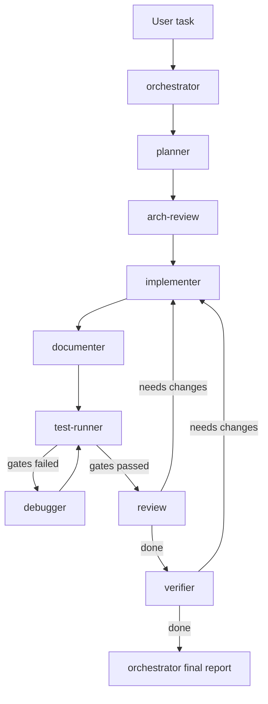

# Организация работы субагентов

Документ описывает текущую схему взаимодействия кастомных субагентов в проекте и объясняет, почему в некоторых задачах задействуются не все роли.

## 1. Общая идея

Оркестрация построена вокруг роли `orchestrator`, которая:

- выбирает последовательность ролей;
- контролирует handoff между ролями;
- принимает решение о возврате на предыдущие шаги;
- фиксирует финальный статус `done / needs_changes / blocked`.

## 2. Базовый pipeline

Для компонентных задач базовая последовательность такая:

1. `planner`
2. `arch-review`
3. `implementer`
4. `documenter`
5. `test-runner`
6. `debugger` (только при падении проверок), затем повторно `test-runner`
7. `review`
8. `verifier`

### Важное правило по проверкам

Только `test-runner` запускает:

- `npm run lint`
- `npm run build`
- `npm run storybook:build`

`review` и `verifier` используют артефакты `test-runner` и не должны дублировать полный прогон сборок.

## 3. Блок-схема

Если диаграмма не рендерится в конкретной среде, ориентируйтесь на разделы 2 и 4 этого документа.

## 4. Почему иногда "не все субагенты отработали"

Это ожидаемое поведение, а не ошибка, если:

- `debugger` не запускался: значит quality gates прошли с первого раза;
- `security-auditor` не запускался: задача не затрагивала рискованные зоны (input handling, file/URL processing, auth-like logic, dependency risk);
- `refactor` не запускался: в задаче не было отдельного требования на структурную чистку без изменения поведения.

То есть часть ролей **условные** (optional/on-demand), а не обязательные для каждого тикета.

## 5. Ролевой контракт handoff

Каждая роль должна возвращать единый контракт:

- `status`: `done | needs_changes | blocked`
- `summary`: краткий итог шага
- `artifacts`: файлы/команды/проверки
- `risks`: оставшиеся риски
- `next_role`: следующая роль

Этот формат нужен, чтобы `orchestrator` мог принимать автоматические решения о следующем шаге.

## 6. Правило для CHANGELOG

В `CHANGELOG.md` фиксируются только package-relevant изменения:

- изменения публичного API;
- изменения runtime-поведения;
- визуальные изменения поставляемых компонентов.

Storybook-only изменения (stories, controls, docs wording, decorators, demo-layout) в changelog не вносятся.

## 7. Практический запуск

Рекомендуемый способ запускать процесс:

`/orchestrator <текст задачи>`

Например:

`/orchestrator В компонент Tabs нужно предусмотреть возможность передавать не только текст, но и иконки`

Так вы принудительно запускаете именно orchestrator-поток и получаете предсказуемый порядок ролей.
